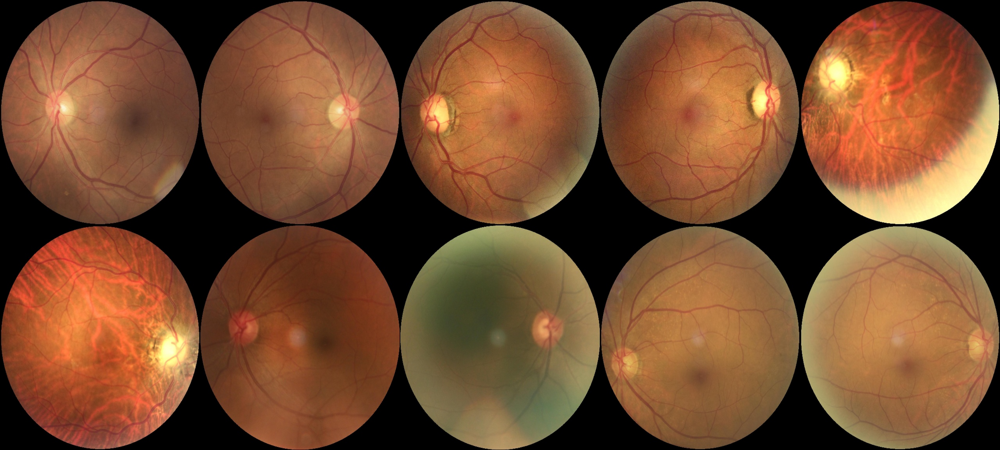
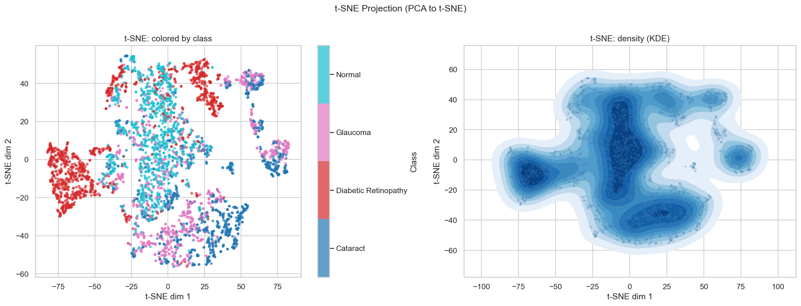

# Final Project Computer Vision

## Eye Disease Classification using Retinal Images

This project tackles the classification of eye diseases from retinal fundus images using **traditional machine learning models**, intentionally avoiding deep learning in favor of **interpretability and transparency** in clinical prediction. By combining classical image preprocessing, handcrafted feature extraction, and well-established classifiers, we aim to build a system that is both accurate and explainable.

## Project Members

| Name | Student ID |
|---|---|
| Criswincent Enrico Geraldy | 2802425474 |
| Gibran Alief Irawan | 2802397325 |
| Muhammad Nizwa | 2802401833 |
| Jason Alvaro Gouw | 2802401770 |
| Lintang Anggowoyuono | 2802398763 |
| Kent Natan Herlambang | 2802397464 |

## Dataset

**Source:** [Eye Diseases Classification: Kaggle](https://www.kaggle.com/datasets/gunavenkatdoddi/eye-diseases-classification)

The dataset consists of retinal fundus photographs labeled into four disease categories. Each image represents a distinct ophthalmic condition that affects different parts of the eye and requires different clinical interventions.

**Target Classes:**

| Class | Samples | Proportion |
|---|---|---|
| Normal | 1,074 | 25.47% |
| Cataract | 1,038 | 24.61% |
| Diabetic Retinopathy | 1,098 | 26.04% |
| Glaucoma | 1,007 | 23.88% |
| **Total** | **4,217** | **100%** |

The dataset is well-balanced across all four classes.

## Methodology

### 1. Preprocessing: CLAHE
We apply **Contrast Limited Adaptive Histogram Equalization (CLAHE)** to enhance the local contrast of retinal images. This is particularly effective for fundus photography, where illumination inconsistencies and low contrast in peripheral regions can obscure important disease markers.

### 2. Feature Extraction
Two complementary feature sets are extracted from each preprocessed image:

- **Intensity Statistics**: captures the global distribution of pixel intensities (mean, variance, skewness, kurtosis, etc.), providing a compact summary of overall brightness and contrast patterns.
- **GLCM (Gray-Level Co-occurrence Matrix)**: captures spatial texture relationships between neighboring pixels. Features include contrast, correlation, energy, and homogeneity, which are effective at distinguishing structural differences between disease types.

### 3. Classification Models
Three traditional ML classifiers are trained and compared for interpretability and performance:

| Model | Notes |
|---|---|
| **Logistic Regression** | Linear baseline, highly interpretable coefficients |
| **SVM (RBF Kernel)** | Non-linear boundary, strong on high-dimensional features |
| **Random Forest** | Ensemble method, provides feature importance scores |

## Results
The work result can be found in here: [Jupyter Notebook](Retinal%20Classification%20Pipeline.ipynb)

## License
This project is licensed under the MIT License. See LICENSE file for details.

## Author
@2025-2026 Muhammad Nizwa. All rights reserved.

## Contributing
Contributions are welcome, Feel free to open issues or submit pull requests for improvements.